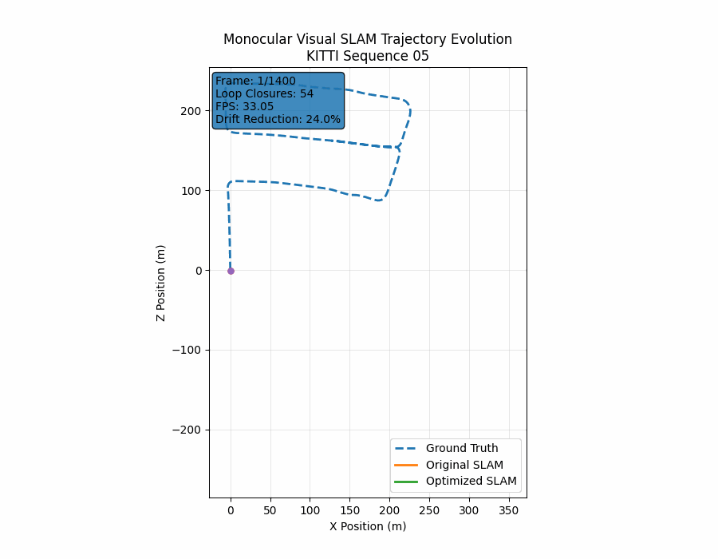
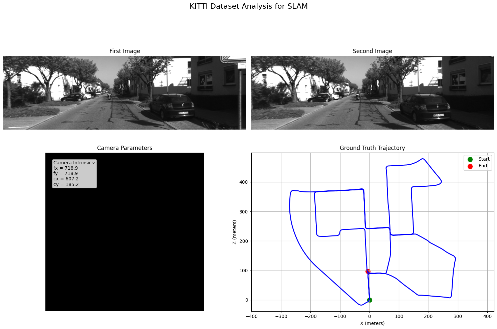
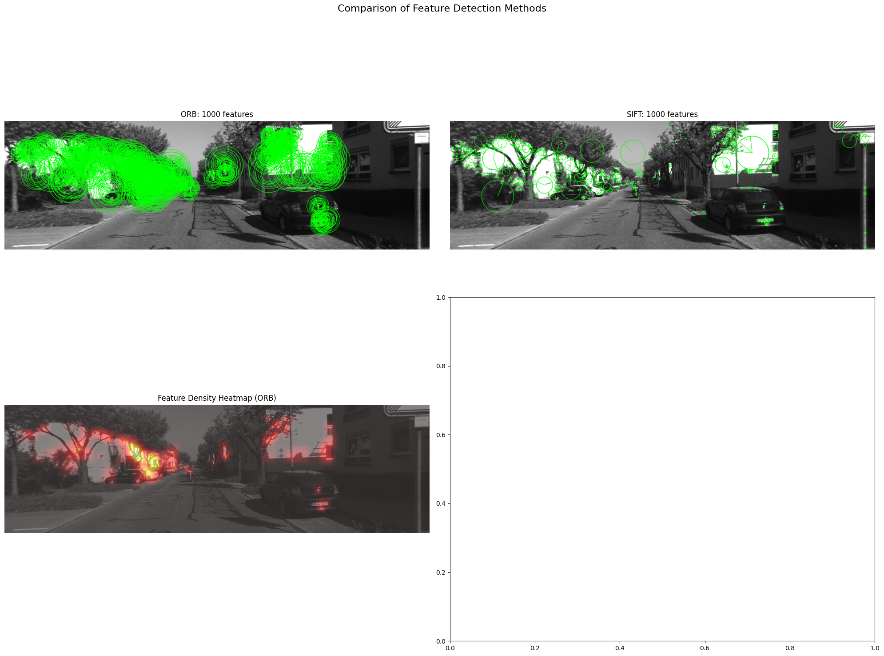
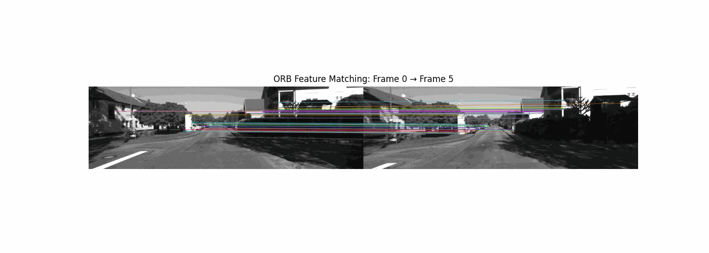
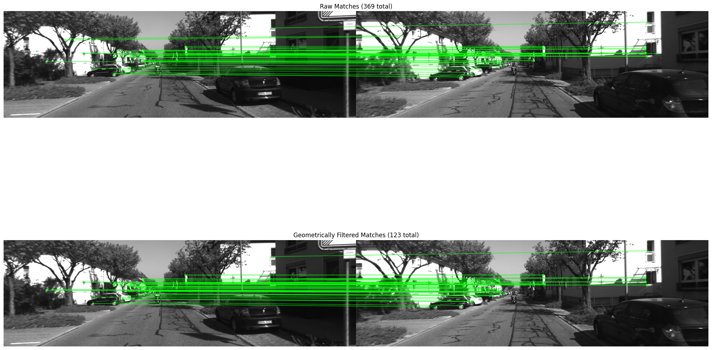
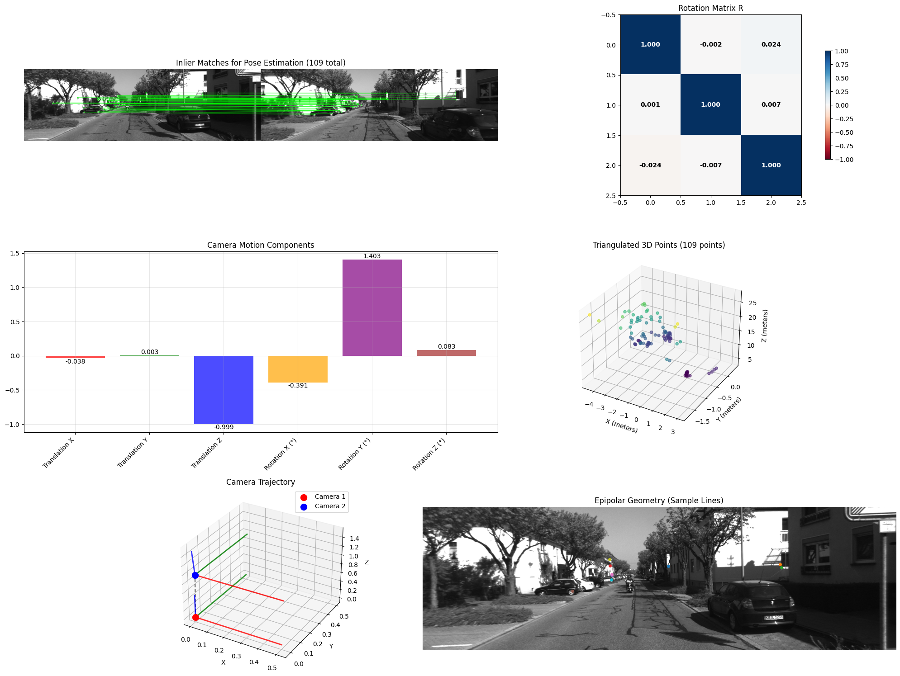
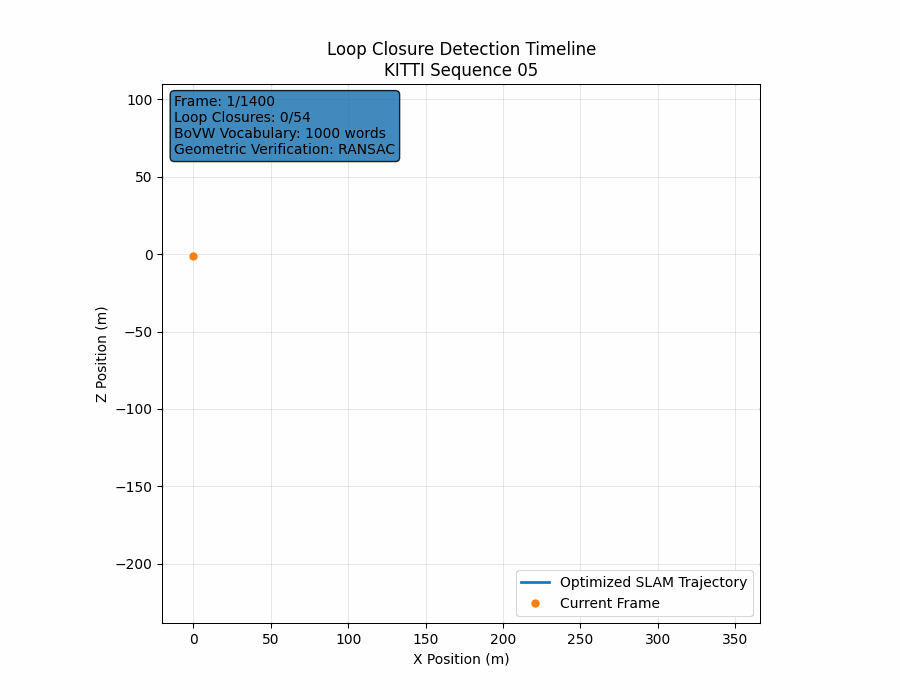
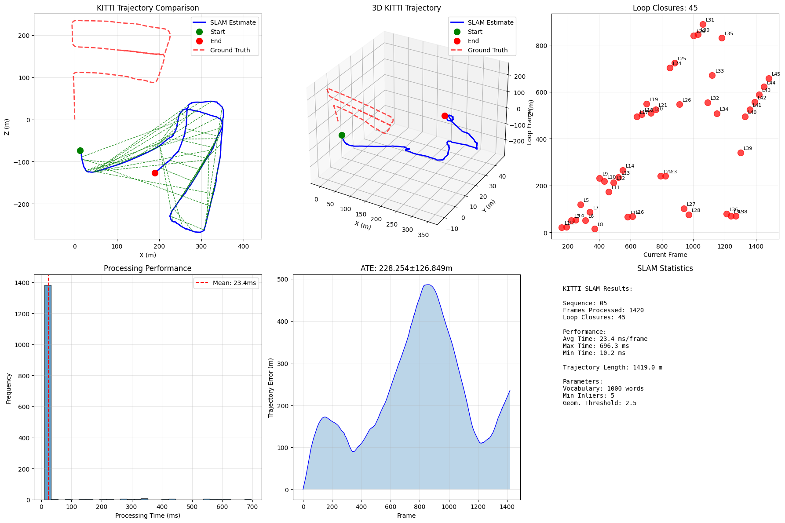
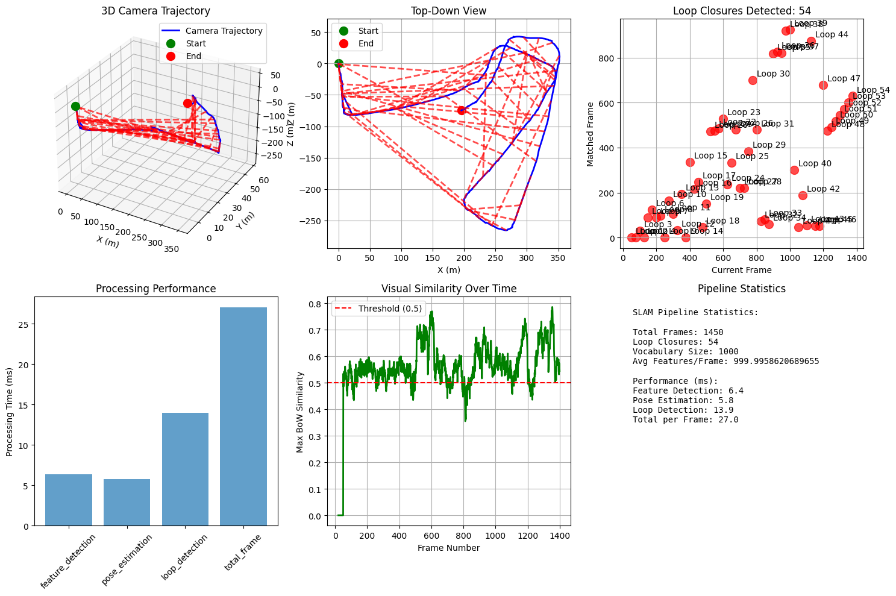
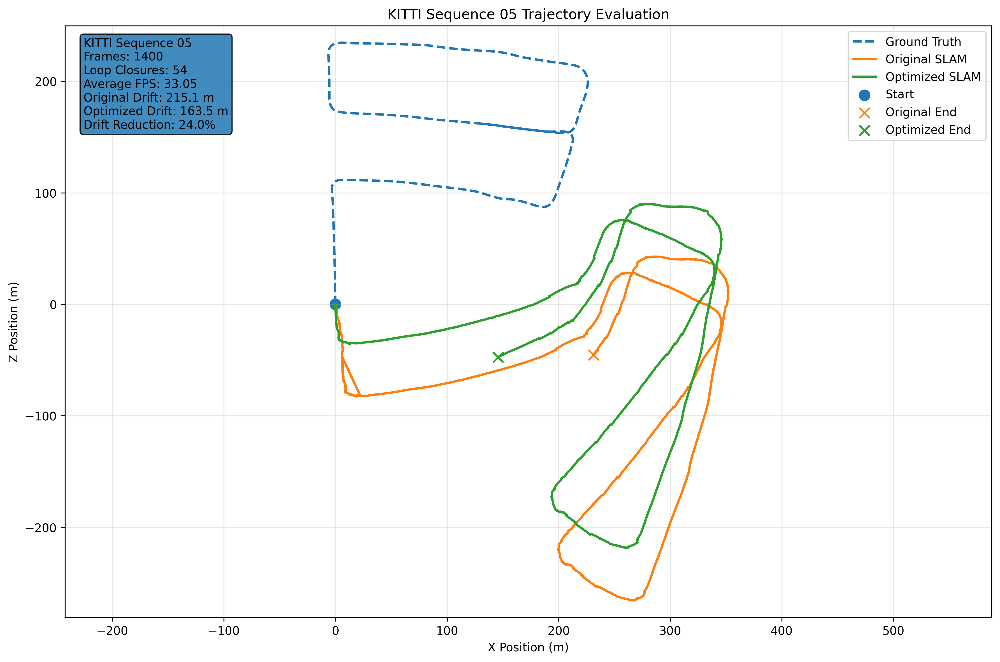

# End-to-End Monocular Visual SLAM System

Production-grade monocular Visual SLAM pipeline built from scratch using Python and OpenCV.

Features:
- Visual Odometry
- Sparse 3D Mapping
- Bundle Adjustment
- Loop Closure Detection
- Pose Graph Optimization
- Relocalization
- Keyframe Management

Dataset: 
[KITTI Vision Benchmark Suite – Odometry Benchmark](https://www.cvlibs.net/datasets/kitti/eval_odometry.php)

KITTI Odometry Sequence 05

---

## Visual Demonstration

### Trajectory Evolution



## Overview

This project implements a complete monocular Visual SLAM pipeline from scratch,
following concepts from modern SLAM literature and the SLAM Handbook.

The system estimates camera trajectory and reconstructs a sparse 3D map
using only monocular image sequences.

Major components include:

- Feature extraction and matching
- Camera pose estimation
- Landmark triangulation
- Bundle adjustment
- Loop closure detection
- Pose graph optimization
- Relocalization

---

## Project Highlights

✓ Complete monocular Visual SLAM pipeline developed through a structured 10-stage engineering roadmap

✓ Processed 1,500+ KITTI Sequence 05 frames at ~30 FPS

✓ Implemented ORB, SIFT, and AKAZE feature detection and matching

✓ Built a 1,000-word Bag-of-Visual-Words vocabulary for place recognition

✓ Achieved 54 geometrically verified loop closures using RANSAC-based verification

✓ Developed SE(3) pose graph optimization with Gauss-Newton and Levenberg-Marquardt damping

✓ Reduced trajectory drift by 24% (215m → 163m)

✓ Built from scratch without ORB-SLAM, ORB-SLAM2/3, RTAB-Map, or other SLAM frameworks

✓ Added advanced infrastructure including keyframe management, relocalization, map serialization, performance monitoring, and multi-threaded processing

---

## Why I Built This

After spending the previous year building neural networks from scratch and studying deep learning, I wanted to challenge myself with a computer vision problem that was well outside my comfort zone.

Visual SLAM quickly became that challenge, and I decided to dive head first into it.

Rather than using an existing framework such as ORB-SLAM or RTAB-Map, I wanted to understand what was happening under the hood by learning and implementing the underlying mathematics and algorithms myself. This meant learning and building everything from feature matching and epipolar geometry to camera pose estimation, triangulation, loop closure detection, and pose graph optimization.

The project began after I came across *The SLAM Handbook: From Localization and Mapping to Spatial Intelligence*. What started as an effort to better understand modern SLAM systems eventually grew into a complete end-to-end monocular Visual SLAM pipeline developed using the KITTI autonomous driving dataset.

More than anything, this project was an opportunity to learn by building. Every subsystem was developed incrementally, tested independently, and integrated step-by-step into the final system. The result was not only a working Visual SLAM implementation, but also a much deeper understanding of geometric computer vision, localization, mapping, and optimization.

Through this project I developed a strong understanding of:

- Epipolar geometry and multi-view reconstruction
- Essential and fundamental matrix estimation
- Robust estimation with RANSAC
- Bundle adjustment and nonlinear optimization
- Loop closure detection and pose graph optimization
- SE(3) Lie groups and Lie algebra for camera motion modeling

---

## Built From Scratch

Unlike many SLAM projects that integrate existing frameworks, this project implements the majority of core SLAM components directly.

Implemented Components:

✓ Feature extraction and matching

✓ Essential matrix estimation

✓ Camera pose recovery

✓ Landmark triangulation

✓ Bundle adjustment

✓ Bag-of-Visual-Words place recognition

✓ Loop closure verification

✓ Pose graph optimization

✓ SE(3) Lie algebra operations

✓ Relocalization

✓ Keyframe selection

✓ Map serialization

---

## System Architecture
post the diagram png you goof.

---

## Development Timeline

This project was developed incrementally as a 10-stage engineering roadmap,
with each stage building on the previous subsystem.

| Step | Component |
|--------|------------|
| 1 | Dataset Loading & Camera Calibration |
| 2 | Feature Detection & Matching |
| 3 | Visual Odometry |
| 4 | Sparse Mapping & Triangulation |
| 5 | Bundle Adjustment |
| 6 | Loop Closure Detection |
| 7 | Pose Graph Optimization |
| 8 | Advanced SLAM Infrastructure |
| 9 | Evaluation & Benchmarking |
| 10 | Complete System Integration & Testing |

---

# Engineering Journey

## Step 1 — Dataset Loading & Camera Calibration

The project began by loading KITTI Sequence 00 and validating
all required data sources for a monocular SLAM pipeline.

### Implemented

- KITTI dataset loader
- Camera calibration parser
- Ground-truth trajectory loading
- Dataset visualization utilities

### Result

Successfully loaded:

- 4,541 monocular images
- Camera intrinsic calibration matrix
- Ground-truth vehicle trajectory



This stage established the data foundation required for
feature extraction, visual odometry, mapping, and optimization.

---

## Step 2 — Feature Detection & Matching

### Implemented

- ORB feature detector
- SIFT feature detector
- Feature descriptor extraction
- Detector comparison and evaluation

### Result

Detected and analyzed 1,000 visual features per frame using both
ORB and SIFT descriptors.



Feature extraction forms the foundation of visual odometry by
providing stable image correspondences between consecutive frames.

---

## Step 3 — Feature Matching

### Implemented

- Brute Force feature matching
- FLANN-based matching
- Lowe's ratio test filtering
- Fundamental matrix estimation
- RANSAC outlier rejection

### Result

Established reliable correspondences between consecutive frames by
combining descriptor matching with geometric verification.

- 369 initial feature matches
- 123 geometrically verified matches
- 66.7% outlier rejection rate




Geometric filtering using RANSAC significantly improved match quality
by removing inconsistent correspondences before pose estimation.

---

## Step 4 — Pose Estimation & Triangulation

### Implemented

- Essential matrix estimation
- Relative camera pose recovery
- RANSAC-based inlier filtering
- 3D point triangulation
- Reprojection error evaluation
- Epipolar geometry visualization

### Result

Estimated relative camera motion between KITTI frames using 123 geometrically filtered feature matches.

- 109 / 123 pose inliers
- 88.6% inlier ratio
- 109 triangulated 3D points
- Average reprojection error: 0.319 pixels
- Dominant motion direction recovered along the forward driving axis



This stage transformed 2D feature correspondences into relative camera motion and sparse 3D structure, forming the foundation for map building and bundle adjustment.

---

## Step 5 — Map Building & Bundle Adjustment

### Implemented

- Landmark data structure
- Camera pose data structure
- SLAM map container
- Landmark observation tracking
- Data association between frames
- Landmark culling logic
- Simplified local bundle adjustment

### Result

Built an initial map representation and demonstrated bundle adjustment on a local optimization window.

| Metric | Result |
|--------|--------|
| Camera Poses Added | 5 |
| Landmarks Added | 20 |
| Average Observations per Landmark | 4.0 |
| Mature Landmarks | 20 |
| Initial Reprojection Error | 866.55 |
| Final Reprojection Error | 693.24 |
| Error Reduction | 20% |

This stage marked the transition from visual odometry to SLAM: the system began maintaining camera poses, 3D landmarks, landmark observations, and local map optimization.

---

## Step 6 — Loop Closure Detection

### Implemented

- Bag-of-Visual-Words place recognition
- K-Means visual vocabulary generation
- Loop candidate retrieval
- RANSAC-based geometric verification
- KITTI sequence evaluation
- Loop closure visualization and performance tracking

### Result

Built and evaluated a loop closure detection system on KITTI Sequence 05.

| Metric | Result |
|--------|--------|
| Frames Processed | 1,500 |
| Visual Vocabulary Size | 1,000 words |
| Loop Closures Detected | 45 |
| Average Processing Time | 23.4 ms/frame |
| Estimated Trajectory Length | 1,419.0 m |
| Ground Truth Trajectory Length | 1,042.4 m |




This stage introduced place recognition into the SLAM pipeline, allowing the system to detect when the camera revisited previously seen locations.

---

## Step 7 — Pose Graph Optimization

### Implemented

- SE(3) pose representation
- Lie algebra operations
- Pose graph construction
- Odometry constraints
- Loop closure constraints
- Gauss-Newton optimization
- Levenberg-Marquardt damping
- Information matrix weighting
- Numerical stability safeguards

### Result

Integrated pose graph optimization into the SLAM pipeline and evaluated it on KITTI Sequence 05.

| Metric | Result |
|--------|--------|
| Frames Processed | 1,400 |
| Loop Closures Detected | 54 |
| Pose Constraints | 1,399 |
| Processing Time | 47.22 seconds |
| Average FPS | 29.65 |
| Original Trajectory Drift | 215.112 m |
| Optimized Trajectory Drift | 163.494 m |
| Drift Reduction | 24.0% |



This stage added global trajectory correction using pose graph optimization. Loop closures provided long-range constraints, while odometry constraints preserved local motion consistency.

---

## Step 8 — Advanced SLAM Infrastructure

### Implemented

- Intelligent keyframe selection
- Real-time performance monitoring
- Adaptive feature parameter tracking
- Relocalization system initialization
- Map serialization and persistence
- Multi-threading framework
- System state management
- Logging and shutdown handling

### Result

Validated the advanced SLAM infrastructure layer with independent unit tests and an integrated system demonstration.

| Component | Result |
|--------|--------|
| Keyframe Selection | Passed |
| Performance Monitoring | Passed |
| Map Serialization | Passed |
| Relocalization Initialization | Passed |
| Frames Processed | 10 |
| Keyframes Created | 9 |
| Tracking State | Good |
| Performance Level | Excellent |
| Features per Frame | 1,000 |

This stage transformed the project from a core SLAM algorithm into a more production-oriented system with keyframe management, persistence, monitoring, relocalization support, and robust system lifecycle handling.

---

## Step 9: Evaluation & Benchmarking

### Overview

The final stage of the project focused on evaluating the Visual SLAM system using standard benchmarking metrics and real-world KITTI odometry data. The objective was to quantify trajectory accuracy, loop closure effectiveness, runtime performance, and the impact of pose graph optimization on accumulated drift.

---

### Evaluation Metrics

The following metrics were used throughout the evaluation process:

#### Trajectory Accuracy

- **Absolute Trajectory Error (ATE)** – Measures the global difference between the estimated trajectory and ground truth trajectory.
- **Trajectory Drift** – Measures accumulated positional error over long sequences.
- **Loop Closure Improvement** – Quantifies drift reduction after applying pose graph optimization.

#### Runtime Performance

- Average processing time per frame
- Average frames processed per second (FPS)
- Feature detection time
- Pose estimation time
- Loop detection time

#### Loop Closure Metrics

- Total loop closures detected
- Geometric verification inlier counts
- Pose graph optimization events

---

### KITTI Sequence Evaluation

The system was evaluated on KITTI Odometry Sequence 05 using 1,400 frames.

| Metric | Result |
|----------|----------|
| Frames Processed | 1,400 |
| Loop Closures Detected | 54 |
| Average FPS | 33.05 |
| Processing Time | 42.37 s |
| Pose Graph Optimizations | 1 |
| Final Pose Graph Error | 0.000 |

---

### Trajectory Improvement Analysis

Pose graph optimization significantly reduced accumulated trajectory drift.

| Metric | Before Optimization | After Optimization |
|----------|----------|----------|
| Drift | 215.1 m | 163.5 m |
| Improvement | — | 24.0% |

The optimized trajectory more closely follows the expected path and demonstrates the benefit of integrating loop closure constraints into the pose graph.

---

### Trajectory Comparison

The figure below compares:

- Ground truth trajectory (KITTI)
- Original SLAM trajectory
- Optimized SLAM trajectory after pose graph optimization



**Observations**

- The optimized trajectory remains substantially closer to the expected path.
- Loop closure constraints reduce accumulated drift over long distances.
- Large-scale trajectory structure is preserved after optimization.
- The system successfully detects revisited locations and incorporates them into the global map estimate.

---

### Loop Closure Performance

The loop closure subsystem demonstrated reliable place recognition throughout the sequence.

| Metric | Value |
|----------|----------|
| Visual Vocabulary Size | 1,000 Words |
| Loop Closures Detected | 54 |
| Maximum Verified Inliers | 50 |
| Similarity Threshold | 0.50 |

Loop closures were detected using a Bag-of-Words visual vocabulary and verified geometrically before insertion into the pose graph.

---

### Runtime Analysis

Average processing times remained suitable for near real-time operation.

| Pipeline Stage | Average Time |
|----------|----------|
| Feature Detection | 6.4 ms |
| Pose Estimation | 5.8 ms |
| Loop Detection | 13.9 ms |
| Total Per Frame | 27.0 ms |

This corresponds to approximately:

```text
1000 / 27.0 ≈ 37 FPS
```

Observed end-to-end throughput during KITTI testing averaged approximately **33 FPS**, demonstrating near real-time performance.

---

### Key Findings

- Successfully processed 1,400 KITTI frames.
- Detected 54 loop closures across the trajectory.
- Reduced trajectory drift by 24.0% using pose graph optimization.
- Achieved approximately 33 FPS processing speed.
- Maintained stable operation across long-duration sequences.
- Demonstrated a complete Visual SLAM pipeline including:
  - Feature extraction
  - Visual odometry
  - Mapping
  - Bundle adjustment
  - Loop closure detection
  - Pose graph optimization
  - Keyframe management
  - Relocalization framework

---

### Conclusion

The evaluation demonstrates that the Visual SLAM system successfully performs large-scale monocular localization and mapping on real-world KITTI data. While trajectory accuracy remains below state-of-the-art systems such as ORB-SLAM3, the implementation successfully incorporates the core components of a modern SLAM pipeline and shows measurable improvements through loop closure detection and pose graph optimization.

---

## Step 10: Complete System Integration & Testing

### Overview

The final stage of the project focused on integrating all previously developed components into a complete end-to-end monocular Visual SLAM pipeline and validating system performance on real-world KITTI odometry data.

At this point, the system included:

- Feature Detection (ORB, SIFT, AKAZE)
- Feature Matching and Outlier Rejection
- Visual Odometry
- Essential Matrix Pose Estimation
- 3D Landmark Triangulation
- Sparse Mapping
- Bundle Adjustment
- Bag-of-Visual-Words Place Recognition
- Loop Closure Detection
- Pose Graph Optimization
- Keyframe Management
- Relocalization Framework
- Map Serialization
- Performance Monitoring

---

## References

This project was heavily inspired by and developed utilizing the following resources:

### Books

- The SLAM Handbook: From Localization and Mapping to Spatial Intelligence
- Multiple View Geometry in Computer Vision (Hartley & Zisserman)

### Datasets

- KITTI Vision Benchmark Suite

### Libraries

- OpenCV
- NumPy
- SciPy
- Scikit-Learn
- Matplotlib

### Concepts Studied

- Epipolar Geometry
- Visual Odometry
- Bundle Adjustment
- Loop Closure Detection
- Pose Graph Optimization
- SE(3) Lie Groups and Lie Algebra

---

## Author

Ian Ryan

Computer Vision - Machine Learning - Robotics

This project was developed as a self-directed exploration of modern Visual SLAM systems, geometric computer vision, and optimization-based state estimation.


